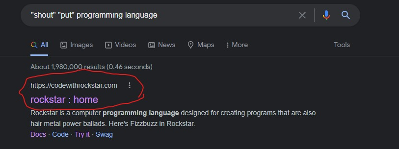
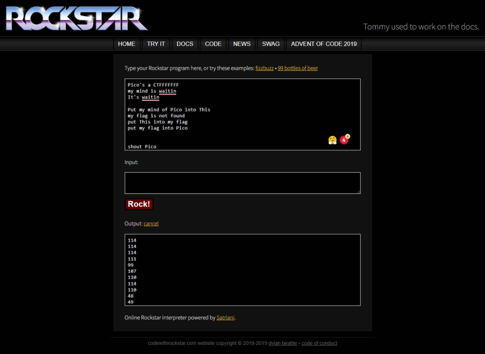

# mus1c

General Skills, 300 points

## Description:

> I wrote you a song. Put it in the picoCTF{} flag format

```
Pico's a CTFFFFFFF
my mind is waitin
It's waitin

Put my mind of Pico into This
my flag is not found
put This into my flag
put my flag into Pico


shout Pico
shout Pico
shout Pico

My song's something
put Pico into This

Knock This down, down, down
put This into CTF

shout CTF
my lyric is nothing
Put This without my song into my lyric
Knock my lyric down, down, down

shout my lyric

Put my lyric into This
Put my song with This into my lyric
Knock my lyric down

shout my lyric

Build my lyric up, up ,up

shout my lyric
shout Pico
shout It

Pico CTF is fun
security is important
Fun is fun
Put security with fun into Pico CTF
Build Fun up
shout fun times Pico CTF
put fun times Pico CTF into my song

build it up

shout it
shout it

build it up, up
shout it
shout Pico
```

## Solution:

This song has the very slight scent of a programming language, and indeed, searching for ["shout" "put" programming language](https://www.google.com/search?q=%22shout%22+%22put%22+programming+language)

</br>
It's has also Hints:</br> 
</br></br>brings us to a language called [Rockstar](https://codewithrockstar.com/).

> Rockstar is a computer programming language designed for creating programs that are also hair metal power ballads.

Pasting the program into the [online interpreter](https://codewithrockstar.com/online), we get the following output:


```
114
114
114
111
99
107
110
114
110
48
49
49
51
114
```

This looks like ASCII, let's decode it:

```python
>>> AsciiNumber = """114
... 114
... 114
... 111
... 99
... 107
... 110
... 114
... 110
... 48
... 49
... 49
... 51
... 114
... """
>>> for i in AsciiNumber.split():
...     print(chr(int(i)), end='')
...
rrrocknrn0113r
>>>
```

So whats your flag?
>picoCTF{rrrocknrn0113r}
